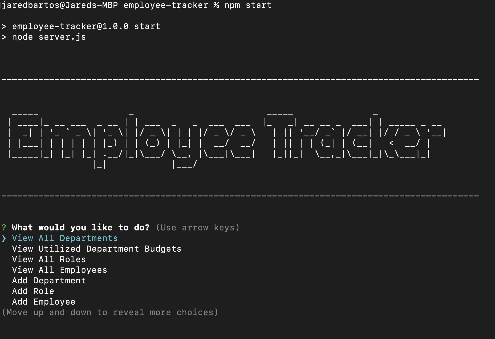

# Employee Tracker

## Description

Employee Tracker is an Node.js app that communicates with a local database using MySQL2 and Inquirer. It is used to view employees, roles, and departments within a company. 
It also allows a user to add, change or delete items in the database.

## Table of Contents
- [Installation](#installation)
- [Requirements](#requirements)
- [Usage](#usage)
- [License](#license)
- [Questions](#questions)
- [Link to Demonstration Video](#link-to-demonstration-video)
- [Screenshot](#screenshot)

## Installation

To install the application, download the zip file from the GitHub repo, or clone the repo into your chosen directory.

## Requirements

[Node.js](https://nodejs.org/en)

[MySQL](https://www.mysql.com/)

## Usage

To use the Employee Tracker, open your terminal and navigate to the directory where the downloaded folder resides.

Enter the following command to install required node modules:

<code>npm i</code>

Navigate into the "db" folder:

<code>cd db</code>

Initiate MySQL Client and enter:

<code>SOURCE schema.sql;</code>

<code>SOURCE seeds.sql;</code>

Then enter the command:

<code>npm start</code> 

Answer the prompts to interact with the company database.

## License

This application is covered under MIT License.

Please refer to the LICENSE file in repo for more information.

## Questions

My GitHub profile: https://github.com/jaredbartos

If you have any further questions, please contact me through email.

jaredbartos@gmail.com

## Link to Demonstration Video

[Employee Tracker](https://drive.google.com/file/d/1V3ISAaogk9kvCz5fpmC1kyUcrTrzVkqY/view?usp=sharing)

## Screenshot

